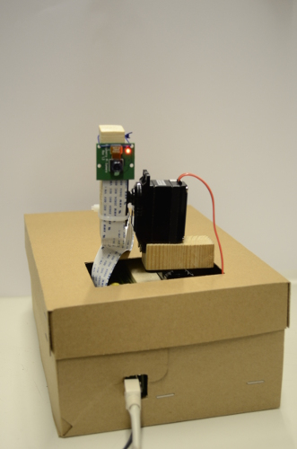

{: style="float: right"}
Willkommen auf unserer Seite zum Robotik-Praktikum „Webcamsteuerung mit dem Raspberry Pi“ im Sommersemester 2014 am Interdisziplinären Zentrum für Wissenschaftliches Rechnen (IWR) an der Ruprecht-Karls-Universität Heidelberg.

## Aufgabenstellung
Bau eines Gerüstes inkl. Schwenkvorrichtung für die Kamera und
Erstellung eines Webservers mit folgenden Funktionen:

* Anzeige eines Live-Streams
* UI zur Steuerung der Kamera
