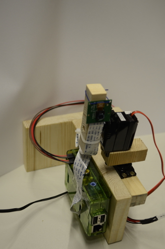
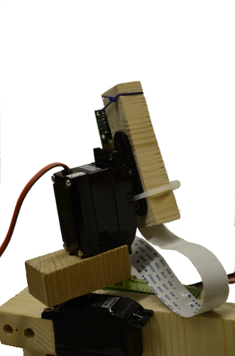
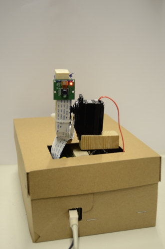

Die folgenden Sektionen befassen sich mit dem Hardware-Teil unseres Praktikums.

## Haltevorrichtung
Der Zweck dieses Teils ist einerseits alle anderen Segmente der Konstruktion zusammenzuhalten; andererseits sollte er die Montage an einer Wand erlauben. Zudem sollte die Haltevorrichtung über einen stabilen Stand verfügen. Wir entschieden uns zu der für diese Zwecke funktionalen T-Form.

## Schwenkvorrichtung
Dieser Teil der Konstruktion ermöglicht die Ausrichtung der Kamera. Diese Funktionalität wird durch zwei Servomotoren unterstützt, von denen jeweils einer zur horizontalen und einer zur vertikalen Orientierung verwendet wird.

## Verkleidung
Da eine Anbringung unwahrscheinlich erschien, entschieden wir uns die Wandmontagemöglichkeit zugunsten eines unaufdringlichen Äußeren schwächer zu priorisieren. Zu diesem Zweck haben wir den Großteil der Konstruktion in einem dezenten Pappkarton untergebracht.

## Hardware
Wir haben die folgende Hardware benutzt:

* [Raspberry Pi Model B Revision 2](http://de.wikipedia.org/wiki/Raspberry_Pi)
* [Raspberry Pi Camera Board](http://www.raspberrypi.org/products/camera-module/)
* Standard Analog Servo MC-410
