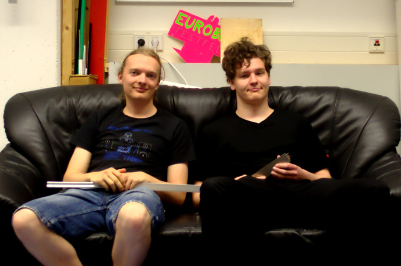

Das sind wir:

* [Johannes Visintini](mailto:visintini@stud.uni-heidelberg.de), 7. Semester Angewandte Informatik B.Sc.
* [Philip Bell](mailto:philip.bell@web.de), 7. Semester Mathematik B.Sc.

betreut von Markus Kurz bzw. Gero Plettenberg und Thomas Kloepfer

> Das Praktikum hat uns sehr viel Spaß gemacht, auch wenn es häufig harte
> Arbeit war und wir lange diskutieren und miteinander streiten mussten. Aber
> das hat das Band zwischen uns nur noch stärker gemacht und wir beenden diese
> Zeit unseres Lebens als bessere Menschen. (Saskia Klaus, Anfängerpraktikum
> 2013)
