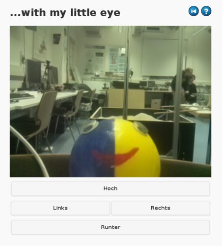
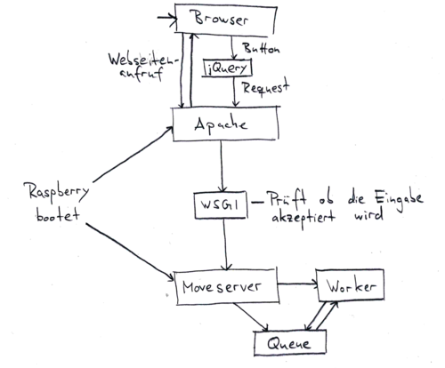

## Webseite

#### mJPG-Streamer

Das Frontend ist mehrstufig aufgebaut. Der mJPG-Streamer mit Plugin für die raspicam des Raspberry Pi ([source](https://github.com/jacksonliam/mjpg-streamer)) stellt den Stream in einer selbst gebauten HTML-Seite dar. Dieser wird als [Dienst](dummy.html) beim booten gestartet und läuft (unabhängig von den anderen Komponenten des Setups).

#### Apache

Als Webserver wird Apache verwendet, der als sehr stabil gilt. Dieser fungiert als Instanz die mit dem Browser des Clients kommuniziert. Sämtlicher Datenverkehr (auch zum [mJPG-Streamer](#mjpg-streamer)) läuft über Apache. Der Webserver nimmt auch die Steuerbefehle entgegen und leitet sie über ein WSGI-Skript, dass eine Verbindung zum [moveserver](dummy.html) aufbaut, an denselben weiter. Dieses WSGI-Skript überprüft auch, ob die Bewegungsrichtung erlaubt ist. So können falsche Werte nicht an den moveserver weiter gegeben werden.

## Sicherheit

Da der Raspberry Pi als ganz normaler Computer bzw. Server im öffentlichen Netz hängt, musste sich überlegt werden wie dieser gegenüber Angriffe aus dem Internet abgesichert wird.

Als Firewall wird die populäre Firewall *iptables* und zur einfacheren Konfiguriation derselben *firehol* verwendet. Diese ist so konfiguriert, dass nur Anfragen aus dem Uninetz akzeptiert werden. Außerdem sind nur die Dienste *http* (Port 80, für den Webserver) und *ssh* (Port 22, zur Konfiguriation und Wartung) freigegeben.
